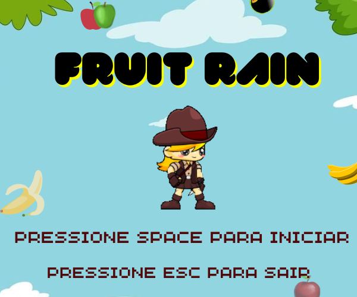

# Jogo-Fruit-Rain

Fruit Rain é um jogo divertido e viciante onde frutas caem do céu e você deve pegar apenas as frutas boas para acumular pontos. Tenha cuidado com as frutas podres, pois ao tocá-las, você perderá vida. À medida que o tempo passa, a velocidade das frutas aumenta, tornando o jogo cada vez mais desafiador. Seu objetivo é atingir uma pontuação específica antes de ficar sem vida. Boa sorte!

## Como Jogar
Controles: Use as setas direita e esquerda do teclado para mover o seu personagem para a esquerda e direita, respectivamente.

**Frutas Boas:** As frutas boas valem pontos. Toque nelas para acumular pontuação.

**Frutas Podres:** Evite as frutas podres a todo custo. Tocá-las reduzirá sua vida.

**Pontuação:** Cada fruta boa coletada adiciona uma quantidade específica de pontos à sua pontuação total.

**Velocidade:** Com o tempo, a velocidade das frutas aumentará, tornando o jogo mais desafiador.

**Objetivo:** Seu objetivo é atingir a pontuação alvo antes de perder toda a sua vida. Se você alcançar a pontuação alvo, você vence o jogo!

## Instalação

 Clone este repositório para o seu computador usando o seguinte comando:
 git clone https://github.com/SabrynaS/Jogo-Fruit-Rain.git

Navegue até o diretório do jogo:
cd fruit-rain

